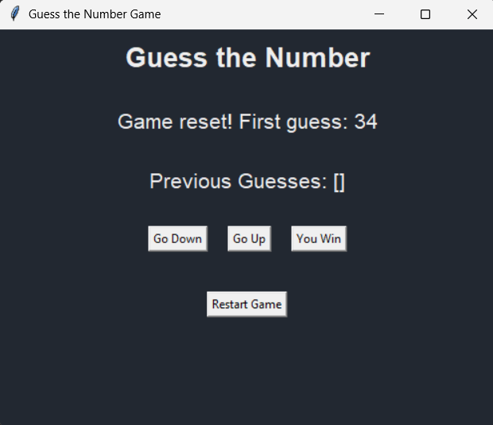

# حدس عدد توسط کامپیوتر

این پروژه یک بازی ساده حدس عدد است که در آن کامپیوتر عددی تصادفی بین 0 و 99 انتخاب می‌کند و شما با دادن سرنخ "بزرگتر" یا "کوچکتر" به کامپیوتر کمک می‌کنید تا عدد رو پیدا کنه. این پروژه به عنوان تمرینی برای درس برنامه‌نویسی و بر اساس تمرین‌های استاد جادی ساخته شده است.

## نحوه بازی

1.  بازی با انتخاب یک عدد تصادفی توسط کامپیوتر شروع می‌شود.
2.  کامپیوتر حدسی می‌زند.
3.  شما با استفاده از دکمه‌های "Go Up" (بزرگتر)، "Go Down" (کوچکتر) یا "You Win" (برنده شدم) به کامپیوتر راهنمایی می‌دهید.
4.  کامپیوتر با توجه به راهنمایی شما، حدس بعدی را می‌زند.
5.  این روند تا زمانی که کامپیوتر عدد صحیح را حدس بزند ادامه دارد.

## نحوه اجرا

برای اجرای این بازی، به پایتون 3 و کتابخانه `tkinter` نیاز دارید. `tkinter` معمولاً به صورت پیش‌فرض با پایتون نصب می‌شود. اگر نصب نبود، می‌توانید از طریق pip نصبش کنید (معمولا نیازی نیست):

```bash
# pip install tkinter
